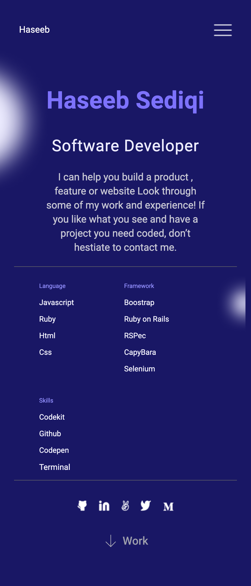

# Project Name
# My Portfolio

> This is second project in Microverse. This project is about building My portfolio website.

Additional description about the project and its features.

## Built With

- CSS
- HTML
- VSCode

## Live Demo

[Live Demo Link](https://haseebsediqi.github.io/MyPortfolio/)

# To get a local copy up and running follow these simple example steps. first click on the above "Live Demo Link". Once the link is open, click on the green "code" button on the top right. then click on download.

To get a local copy up and running follow these simple example steps.

### Prerequisites

### Setup

### Install

### Usage

### Run tests

### Deployment

## Authors

👤 **Haseeb**

- GitHub: [@githubhandle](https://github.com/HaseebSediqi)
- LinkedIn: [LinkedIn](http://linkedin.com/in/haseeb-sediqi)

## 🤝 Contributing

Contributions, issues, and feature requests are welcome!

Feel free to check the [issues page](../../issues/).

## Show your support

Give a ⭐️ if you like this project!

## Acknowledgments

- Hat tip to anyone whose code was used
- Inspiration
- etc

## 📝 License

This project is [MIT](./MIT.md) licensed.
